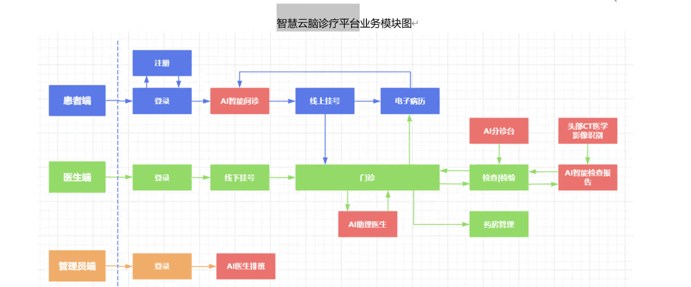

# Filter 完整子模块交付评估与后续工作指导

## 1. 当前结论

当前 Filter 模块暂时不建议作为“完整可交付子模块”直接并入智慧云脑诊疗平台。

### 整体项目布局


更准确的状态是：

```text
可演示原型 / AI 推理微服务雏形
```

它已经具备 CT 金属伪影检测服务的核心形态，但还缺少平台级交付需要的接口契约、异步任务、结构化结果、模型版本、日志审计、异常处理、部署说明和验收测试。


当前不适合直接承诺为：

- 医疗平台正式生产子模块。
- 完整头部 CT 医学影像识别系统。
- 完整 AI 检查报告生成系统。
- 可审计、可追踪、可灰度发布的算法服务。

## 2. 当前已有能力

FastAPI 目录下已经具备两个服务入口：

```text
Fastapi/CTDetectionServer.py
Fastapi/CTDetectionServer_unet2d.py
```

已有能力包括：

- 3D U-Net 主服务。
- 2D U-Net 备用服务。
- `GET /health` 健康检查。
- `POST /predict-ct-artifact` 上传 `.nii/.nii.gz` CT 并生成 mask。
- `GET /results/{mask_filename}` 下载生成的 mask。
- 本地上传目录和结果目录。
- 基础前端页面 `/ui`。
- 模型加载失败时服务仍可启动，并通过 `/health` 暴露 degraded 状态。

这些能力说明当前模块已经具备“算法服务化”的基础，不需要推倒重做。

## 3. 为什么还不是完整子模块

### 3.1 业务边界还不够明确

图中的“头部 CT 医学影像识别”不是只做金属伪影识别，它通常还包括脑出血、颅骨骨折、脑梗、中线移位、占位效应等识别能力。

Filter 当前只适合定义为：

```text
头部 CT 医学影像识别流程中的影像质控与金属伪影识别子模块
```

因此交付时不能把它描述成完整头部 CT 诊断系统。

### 3.2 输入输出还不够平台化

当前接口主要接收 `.nii/.nii.gz` 文件，返回 mask 下载地址和基础统计信息。

正式平台中更常见的是：

- DICOM Study / Series。
- 检查单 ID。
- 患者 ID。
- 医生 ID。
- 报告 ID。
- 对象存储地址。
- 任务 ID。

后续需要从“上传文件后立即推理”升级为“平台任务式调用”。

### 3.3 结果 JSON 不够完整

当前结果已有：

- `request_id`
- `mask_file`
- `positive_voxels`
- `shape`
- `spacing`
- `origin`
- `direction`
- `download_url`

但完整子模块还需要：

- `artifact_detected`
- `artifact_ratio`
- `severity`
- `affected_slices`
- `model_name`
- `model_version`
- `backend`
- `threshold`
- `elapsed_ms`
- `report_suggestion`
- `input_metadata`
- `error_code`

### 3.4 缺少异步任务机制

CT 推理可能耗时较长。

建议后续改成：

```text
POST /api/ct-artifact/tasks
GET  /api/ct-artifact/tasks/{task_id}
GET  /api/ct-artifact/results/{task_id}
```

### 3.5 缺少模型版本与审计信息

医疗 AI 服务必须能回答：

- 这次结果由哪个模型生成？
- 模型权重路径是什么？
- 模型版本号是什么？
- 阈值是多少？
- 推理时间是多少？
- 是否发生异常？
- 医生是否确认？
- 结果是否进入报告？

当前模块还没有形成完整追踪链路。


### 3.7 缺少交付验证材料

完整子模块至少需要：

- 接口文档。
- 示例请求和响应。
- 部署说明。
- 环境变量说明。
- 模型权重说明。
- 测试样例。
- smoke test。
- Spring Boot 调用示例。
- 错误码说明。

## 4. 建议交付定位

建议把当前模块定义为：

```text
Filter：头部 CT 影像质控与金属伪影识别子模块
```

职责边界：

- 读取 CT 影像。
- 生成金属伪影 mask。
- 统计伪影影响范围。
- 输出结构化质控结果。
- 给 AI 检查报告提供质控提示。
- 给医生端提供可审核结果。

非职责边界：

- 不负责完整诊断。
- 不负责电子病历。
- 不负责挂号和问诊。
- 不负责药房管理。
- 不直接生成最终医学结论。
- 不替代医生审核。

## 5. 最小可交付版本标准

建议把“完整子模块交付”定义为以下最小标准。

### 5.1 接口标准

至少提供：

```text
GET  /api/ct-artifact/health
POST /api/ct-artifact/detect
GET  /api/ct-artifact/results/{request_id}
GET  /api/ct-artifact/files/{file_name}
```

如果推理耗时明显，应改为：

```text
POST /api/ct-artifact/tasks
GET  /api/ct-artifact/tasks/{task_id}
GET  /api/ct-artifact/results/{task_id}
```

### 5.2 输入标准

第一阶段至少支持：

- `.nii`
- `.nii.gz`

第二阶段建议支持：

- DICOM 序列文件夹。
- DICOM zip。
- 对象存储 URL。

### 5.3 输出标准

每次推理应生成：

```text
filter_outputs/
  {request_id}/
    mask.nii.gz
    result.json
    preview_axial.png
    preview_coronal.png
    preview_sagittal.png
```

`result.json` 推荐结构：

```json
{
  "request_id": "xxx",
  "status": "success",
  "module": "ct_artifact_filter",
  "backend": "unet3d",
  "model_name": "metal_unet3d",
  "model_version": "v1.0.0",
  "model_weight": "best_unet3d_metal.pt",
  "artifact_detected": true,
  "artifact_ratio": 0.034,
  "positive_voxels": 12345,
  "affected_slices": [42, 43, 44],
  "severity": "moderate",
  "threshold": 0.35,
  "shape": [512, 512, 128],
  "spacing": [0.48, 0.48, 1.0],
  "mask_file": "mask.nii.gz",
  "preview_files": {
    "axial": "preview_axial.png",
    "coronal": "preview_coronal.png",
    "sagittal": "preview_sagittal.png"
  },
  "report_suggestion": "存在中度金属伪影，可能影响邻近区域判断，建议医生结合原始影像复核。",
  "elapsed_ms": 15320
}
```


Filter 服务负责：

- 影像推理。
- mask 生成。
- 结构化结果生成。

推荐关系：

```text
  -> 调用 Filter FastAPI
  -> 保存 result.json
  -> 将 report_suggestion 合并进 AI 检查报告
```

## 6. 后续工作路线

### P0：完成可交付接口契约

目标：让主系统可以稳定调用。

任务：

1. 统一 3D 和 2D 服务的返回 JSON 字段。
2. 将接口路径整理为 `/api/ct-artifact/...`。
3. 增加 `artifact_ratio`、`severity`、`affected_slices`。
4. 增加 `model_name`、`model_version`、`backend`。
5. 增加 `elapsed_ms`。
6. 增加统一错误响应。

验收：

- 主系统能上传一例 NIfTI。
- 能拿到稳定 JSON。
- 能根据 `download_url` 下载 mask。
- 异常时能拿到明确错误码和错误信息。

### P1：增加任务式推理

目标：避免大文件推理阻塞 HTTP 请求。

任务：

1. 增加任务 ID。
2. 增加任务状态：`queued`、`running`、`success`、`failed`。
3. 推理结果落盘。
4. 查询任务状态。
5. 查询任务结果。

推荐接口：

```text
POST /api/ct-artifact/tasks
GET  /api/ct-artifact/tasks/{task_id}
GET  /api/ct-artifact/results/{task_id}
```

验收：

- 上传后立即返回 `task_id`。
- 任务完成后可读取完整结果。

### P2：增加 DICOM 对接能力

目标：贴近真实检查检验流程。

任务：

1. 支持 DICOM zip 上传。
2. 支持 DICOM Series 转 NIfTI。
3. 保存 StudyInstanceUID、SeriesInstanceUID。
4. 将 DICOM 元数据写入结果。

验收：

- 给定一组 DICOM 序列可完成推理。
- 输出结果中包含检查和序列标识。

### P3：增加预览图和医生审核闭环

目标：让结果可被医生端直接使用。

任务：

1. 生成三平面预览图。
2. 生成 CT + mask 叠加图。
3. 支持医生端下载 mask。
4. 支持医生修正后的 mask 回传。
5. 保存 `review.json`。

验收：

- 医生端能查看伪影位置。
- 能保存 AI mask 和医生修正 mask。
- 能记录审核状态。

## 7. 推荐目录结构

一种可能的后续整理为：

```text
Filter/
  Fastapi/
    CTDetectionServer.py
    CTDetectionServer_unet2d.py
    requirements.txt
    README.md
    .env.example
    tests/
      test_health.py
      test_predict_api.py
    frontend/
    uploads/
    results/
  filter_outputs/
    {request_id}/
      mask.nii.gz
      result.json
      preview_axial.png
      preview_coronal.png
      preview_sagittal.png
  reviewed_cases/
    {case_id}/
      ct.nii.gz
      mask_ai.nii.gz
      mask_reviewed.nii.gz
      review.json
```

## 8. 交付分级建议

### Demo 版

可以展示：

- 上传 NIfTI。
- 生成 mask。
- 下载 mask。
- 查看基础统计。

当前模块基本接近 Demo 版。

### MVP 版

必须具备：

- 稳定接口契约。
- 统一 JSON。
- 模型版本。
- 伪影比例。
- 严重程度。
- 结果目录。
- 基础测试。

建议下一阶段目标定为 MVP 版。

## 9. 近期最建议做的 8 个任务

1. 给 3D 和 2D 服务增加统一 `backend`、`model_version`、`artifact_ratio`、`severity`、`affected_slices`。
2. 增加 `result.json` 落盘。
3. 增加三平面 PNG 预览图。
4. 将接口路径迁移或兼容到 `/api/ct-artifact/...`。
5. 增加 smoke test，至少测试 `/health` 和一次推理流程。
6. 增加 `.env.example`，明确模型权重、设备、上传目录、结果目录配置。

## 10. 最终判断

当前阶段：

```text
不是完整可交付子模块
```

但它已经具备完整子模块的核心基础：

```text
FastAPI 服务化 + 2D/3D 模型推理 + mask 输出 + 健康检查 + 前端演示
```

下一步不应该盲目扩展更多诊断模型，而应先把“影像质控与金属伪影识别子模块”的工程交付闭环补齐。

推荐目标：

```text
先交付 MVP 级 Filter 子模块，再考虑扩展到完整头部 CT 医学影像识别体系。
```
---

### 约束
- 若有需要且未安装的依赖，不要跳过，直接安装。依赖尽可能不要安装在系统盘
- 不要同时执行多个任务。最小子任务落地后再开始下一个任务
- 额外优化功能要建立在基础系统可用之上，先保证基础功能完善
- 在**整体项目布局**中，该模块要为其他模块提供完整支持