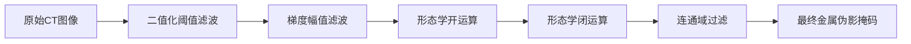

# CT金属伪影检测滤波/处理步骤详解

本文档详细介绍了CT金属伪影标注系统中，6个核心处理步骤的原理、作用与调参建议，帮助你快速理解并优化伪影检测效果。

---

## 1. 二值化阈值滤波（阈值下限/上限）

### 核心作用
定位高亮度金属区域，生成初始候选掩码。

### 原理
CT影像中，不同组织的CT值（Hounsfield Unit, HU）差异显著：
- 软组织：-100 ~ 100 HU
- 骨骼：100 ~ 300 HU
- 金属植入物/伪影：300 ~ 4000 HU（远超其他组织）

二值化滤波通过设置上下限，将图像中CT值处于 `[阈值下限, 阈值上限]` 之间的像素标记为“疑似金属区域”，其余像素标记为背景。

### 参数说明

| 参数 | 作用 | 推荐范围 |
|------|------|----------|
| 阈值下限 | 过滤低于该值的软组织、骨骼，只保留高亮度候选区域 | 300 ~ 1500 HU |
| 阈值上限 | 过滤高于该值的扫描噪声，同时兼容CT机的最大输出范围 | 2000 ~ 4000 HU |

### 伪影检测中的意义
这是整个流程的第一步，先快速圈定所有可能的金属/伪影区域，为后续处理提供基础掩码。

---

## 2. 梯度幅值滤波（梯度阈值）

### 核心作用
强化金属边缘，过滤均匀高亮度背景。

### 原理
金属伪影的典型特征是**边缘锐利、亮度变化剧烈**，而均匀的高亮度噪声（如部分容积效应、扫描噪声）的亮度变化平缓。

梯度幅值滤波通过计算每个像素的亮度变化率（梯度幅值），只保留梯度值大于设定阈值的像素，从而强化金属轮廓，过滤掉均匀背景。

### 参数说明
- 梯度阈值：控制边缘检测的灵敏度，值越大，仅保留变化最剧烈的边缘；值越小，会保留更多弱边缘（可能包含噪声）。
- 推荐范围：50 ~ 500（根据图像噪声水平调整）

### 伪影检测中的意义
避免误将均匀高亮度的骨骼或噪声标记为金属，让后续处理更聚焦于真正的金属边缘和伪影边界。

---

## 3. 形态学开运算（开运算半径）

### 核心作用
去除孤立噪声点，平滑金属区域边界。

### 原理
形态学开运算 = **先腐蚀（Erosion） + 再膨胀（Dilation）**
1. 腐蚀：缩小亮区域，消除细小、孤立的噪声点（如椒盐噪声、微小扫描伪影）
2. 膨胀：恢复亮区域的整体大小，避免过度腐蚀导致金属区域断裂

### 参数说明
- 开运算半径：控制操作的作用范围，半径越大，能去除的噪声点越大，但可能会轻微腐蚀金属边缘。
- 推荐范围：0 ~ 5（3D空间中同时作用于X/Y/Z三个方向）

### 伪影检测中的意义
去除阈值和梯度处理后产生的零散噪点，让金属区域轮廓更干净、连续。

---

## 4. 形态学闭运算（闭运算半径）

### 核心作用
填补金属区域内部孔洞，连接断裂轮廓。

### 原理
形态学闭运算 = **先膨胀（Dilation） + 再腐蚀（Erosion）**
1. 膨胀：扩大亮区域，填补金属区域内部的小孔洞（如部分容积效应导致的CT值断层）
2. 腐蚀：恢复亮区域的整体大小，避免过度膨胀导致区域粘连

### 参数说明
- 闭运算半径：控制操作的作用范围，半径越大，能填补的孔洞越大，但可能会让相邻金属区域粘连。
- 推荐范围：0 ~ 10（3D空间中同时作用于X/Y/Z三个方向）

### 伪影检测中的意义
修复金属区域因CT值波动出现的“空洞”，形成完整、连续的金属掩码。

---

## 5. 连通域过滤（最小面积）

### 核心作用
剔除小面积噪声，保留真实金属区域。

### 原理
连通域分析会将图像中所有相互连接的亮区域标记为独立的“连通域”，并计算每个连通域的像素数量（即面积）。通过设置“最小面积”阈值，剔除面积小于该值的小连通域，只保留体积足够大的区域。

### 参数说明
- 最小面积：控制过滤的灵敏度，值越大，剔除的小噪声越多，但可能会误删细小的金属部件。
- 推荐范围：10 ~ 500（单位：像素数，根据图像分辨率调整）

### 伪影检测中的意义
这是流程的最后一步“去伪存真”，能彻底过滤掉非永久性的扫描噪声，只保留真正的金属植入物或大面积伪影。

---

## 工具实现与使用方式

当前目录已补充两个可运行工具：
- `metal_artifact_mask_tool.py`：命令行版
- `metal_artifact_mask_app.py`：可视化界面版
- `metal_artifact_mask_desktop.py`：PySide6 + VTK 桌面版，包含二维切片预览与三维掩码表面展示

### 功能
- 按本文档描述的 5 步流程生成金属伪影二值掩码：
  1. 二值化阈值筛选
  2. 梯度幅值约束
  3. 开运算去噪
  4. 闭运算补洞
  5. 连通域面积过滤
- 支持直接处理 `numpy` 的 `.npy` 三维数组
- 若本机安装 `SimpleITK`，还支持 `.nii`、`.nii.gz`、`.mha`、`.mhd` 等医学影像格式
- 支持 `--demo` 生成合成 CT 体数据并立即验证流程可用性
- 界面版支持切片选择、多阶段结果对比、参数交互调节和掩码下载

### 环境安装

```bash
pip install -r requirements.txt
```

如果暂时没有安装 `SimpleITK`，工具仍然可以处理 `.npy` 输入并运行 `--demo`。如果要启动界面版，还需要安装 `streamlit`，该依赖已写入 `requirements.txt`。

### 快速验证

命令行版：

```bash
python metal_artifact_mask_tool.py --demo
```

可视化界面版：

```bash
streamlit run metal_artifact_mask_app.py
```

桌面版：

```bash
python metal_artifact_mask_desktop.py
```

桌面版提供：
- 内置 Demo 与本地 `.npy/.nii/.nii.gz/.mha/.mhd` 体数据加载
- 二值化阈值、梯度阈值、开闭运算半径、连通域面积过滤参数调节
- 原始 CT、阈值阶段、梯度阶段、闭运算阶段、最终掩码叠加的切片预览
- 基于 VTK Marching Cubes 的 3D 掩码表面重建，可鼠标旋转、缩放、平移
- 最终掩码保存为 `.npy`，在 SimpleITK 输入模板可用时也可保存医学影像格式

运行界面版后，可获得类似示意图的交互页面，支持：
- 左侧调节阈值、梯度、开闭运算、最小连通域
- 中间查看不同处理阶段的切片结果
- 通过滑块切换切片层号
- 下载最终掩码

命令行版运行后会输出一段 JSON 统计信息，例如：
- 输入体数据尺寸
- 每一步剩余体素数量
- 连通域数量
- 最终掩码保存路径

同时会生成输出文件，例如：
- `demo_seed_1_metal_mask.npy`

### 打包为 exe

安装依赖后，可在当前目录运行：

```powershell
.\build_desktop_exe.ps1
```

成功后输出：

```text
dist/MetalArtifactMaskTool/MetalArtifactMaskTool.exe
```

### 处理真实数据

命令行版：

```bash
python metal_artifact_mask_tool.py ^
  --input ct_volume.npy ^
  --output ct_mask.npy ^
  --threshold-low 800 ^
  --threshold-high 4000 ^
  --gradient-threshold 120 ^
  --opening-radius 1 ^
  --closing-radius 2 ^
  --min-component-size 50
```

界面版：
- 运行 `streamlit run metal_artifact_mask_app.py`
- 在左侧选择“上传文件”
- 上传 `.npy/.nii/.nii.gz/.mha/.mhd` 数据
- 调节参数并查看各阶段结果

### 参数建议

| 参数 | 含义 | 默认值 | 建议 |
|------|------|--------|------|
| `--threshold-low` | 金属候选下限 | 800 | 可按 300~1500 调整 |
| `--threshold-high` | 金属候选上限 | 4000 | 一般 2000~4000 |
| `--gradient-threshold` | 梯度边缘阈值 | 120 | 噪声大时可适当提高 |
| `--opening-radius` | 开运算半径 | 1 | 去孤立点 |
| `--closing-radius` | 闭运算半径 | 2 | 填孔和连边 |
| `--min-component-size` | 最小连通域体素数 | 50 | 分辨率越高可越大 |

### 输出解释
- 输出掩码为 0/1 二值数组
- JSON 中的 `candidate_voxels`、`gradient_voxels`、`opened_voxels`、`closed_voxels`、`final_voxels` 可用于判断每一步是否过松或过严
- 若 `final_voxels` 过少，通常说明阈值过高或梯度阈值过强
- 若 `final_voxels` 过多，通常说明阈值过低或连通域过滤过弱

---

## 完整处理流程（串联逻辑）


