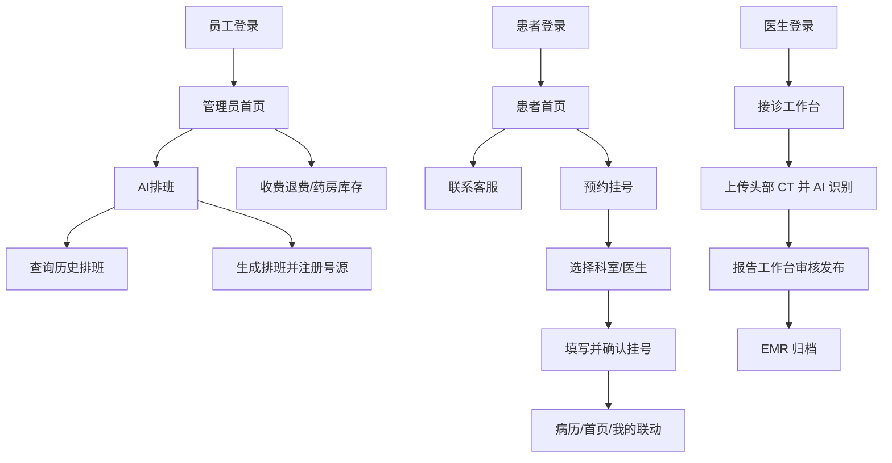

# 用户流程截图级验收流程图 2026-07-06

本文件用于补齐“截图必须插入文档并附文字说明”的硬门禁。以下截图均来自本地 `frontend/visual-results` 下已生成的 Playwright 真实浏览器验收结果。

## 总体用户行为流程图

## 截图覆盖统计

| 范围 | 截图目录 | 嵌入截图数 |
|---|---|---:|
| A. 当前全项目页面截图 | `frontend/visual-results` | 111 |
| B. 头部 CT 真实用户链路 | `frontend/visual-results/headct-real-user-workflow` | 6 |
| C. 填写态、禁用态与筛选态专项补强 | `frontend/visual-results/fill-and-disabled-coverage` | 16 |
| D. 医生接诊五部分填写与交互 | `frontend/visual-results/doctor-visit-five-tabs` | 12 |

> 注意：嵌入截图数表示本文件实际插入的 Markdown 图片数量。若某个自动验收动作在原报告中标记为 SKIP，本文件只能嵌入已有截图，不能把 SKIP 伪装为已覆盖。

## A. 当前全项目页面截图

### root

#### 1. desktop chrome 管理员 drug

- 用户动作/系统反馈：desktop chrome 管理员 drug。
- 截图文件：`frontend/visual-results/desktop-chrome-admin-drug.png`

#### 2. desktop chrome 管理员 finance

- 用户动作/系统反馈：desktop chrome 管理员 finance。
- 截图文件：`frontend/visual-results/desktop-chrome-admin-finance.png`

#### 3. desktop chrome 管理员 排班 sources

- 用户动作/系统反馈：desktop chrome 管理员 排班 sources。
- 截图文件：`frontend/visual-results/desktop-chrome-admin-schedule-sources.png`

#### 4. desktop chrome 管理员 排班

- 用户动作/系统反馈：desktop chrome 管理员 排班。
- 截图文件：`frontend/visual-results/desktop-chrome-admin-schedule.png`

#### 5. desktop chrome 管理员 staff create

- 用户动作/系统反馈：desktop chrome 管理员 staff create。
- 截图文件：`frontend/visual-results/desktop-chrome-admin-staff-create.png`

#### 6. desktop chrome 管理员 stats departments

- 用户动作/系统反馈：desktop chrome 管理员 stats departments。
- 截图文件：`frontend/visual-results/desktop-chrome-admin-stats-departments.png`

#### 7. desktop chrome 管理员 stats 医生s

- 用户动作/系统反馈：desktop chrome 管理员 stats 医生s。
- 截图文件：`frontend/visual-results/desktop-chrome-admin-stats-doctors.png`

#### 8. desktop chrome 管理员

- 用户动作/系统反馈：desktop chrome 管理员。
- 截图文件：`frontend/visual-results/desktop-chrome-admin.png`

#### 9. desktop chrome auth 登录

- 用户动作/系统反馈：desktop chrome auth 登录。
- 截图文件：`frontend/visual-results/desktop-chrome-auth-login.png`

#### 10. desktop chrome 医生 AI diagnosis

- 用户动作/系统反馈：desktop chrome 医生 AI diagnosis。
- 截图文件：`frontend/visual-results/desktop-chrome-doctor-ai-diagnosis.png`

#### 11. desktop chrome 医生 AI triage

- 用户动作/系统反馈：desktop chrome 医生 AI triage。
- 截图文件：`frontend/visual-results/desktop-chrome-doctor-ai-triage.png`

#### 12. desktop chrome 医生 dashboard

- 用户动作/系统反馈：desktop chrome 医生 dashboard。
- 截图文件：`frontend/visual-results/desktop-chrome-doctor-dashboard.png`

#### 13. desktop chrome 医生 我的/资料

- 用户动作/系统反馈：desktop chrome 医生 我的/资料。
- 截图文件：`frontend/visual-results/desktop-chrome-doctor-profile.png`

#### 14. desktop chrome 医生 结果 1

- 用户动作/系统反馈：desktop chrome 医生 结果 1。
- 截图文件：`frontend/visual-results/desktop-chrome-doctor-result-1.png`

#### 15. desktop chrome 医生 排班

- 用户动作/系统反馈：desktop chrome 医生 排班。
- 截图文件：`frontend/visual-results/desktop-chrome-doctor-schedule.png`

#### 16. desktop chrome 医生

- 用户动作/系统反馈：desktop chrome 医生。
- 截图文件：`frontend/visual-results/desktop-chrome-doctor.png`

#### 17. desktop chrome 药房 workbench

- 用户动作/系统反馈：desktop chrome 药房 workbench。
- 截图文件：`frontend/visual-results/desktop-chrome-drugstore-workbench.png`

#### 18. desktop chrome 药房

- 用户动作/系统反馈：desktop chrome 药房。
- 截图文件：`frontend/visual-results/desktop-chrome-drugstore.png`

#### 19. desktop chrome medical tech workbench

- 用户动作/系统反馈：desktop chrome medical tech workbench。
- 截图文件：`frontend/visual-results/desktop-chrome-medical-tech-workbench.png`

#### 20. desktop chrome medical tech

- 用户动作/系统反馈：desktop chrome medical tech。
- 截图文件：`frontend/visual-results/desktop-chrome-medical-tech.png`

#### 21. desktop chrome mini 患者 AI

- 用户动作/系统反馈：desktop chrome mini 患者 AI。
- 截图文件：`frontend/visual-results/desktop-chrome-mini-patient-ai.png`

#### 22. desktop chrome 患者 AI

- 用户动作/系统反馈：desktop chrome 患者 AI。
- 截图文件：`frontend/visual-results/desktop-chrome-patient-ai.png`

#### 23. desktop chrome 患者 预约 成功反馈 挂号Id 1

- 用户动作/系统反馈：desktop chrome 患者 预约 成功反馈 挂号Id 1。
- 截图文件：`frontend/visual-results/desktop-chrome-patient-appointment-success-registerId-1.png`

#### 24. desktop chrome 患者 预约 成功反馈 挂号Id 343

- 用户动作/系统反馈：desktop chrome 患者 预约 成功反馈 挂号Id 343。
- 截图文件：`frontend/visual-results/desktop-chrome-patient-appointment-success-registerId-343.png`

#### 25. desktop chrome 患者 预约 成功反馈 挂号Id 359

- 用户动作/系统反馈：desktop chrome 患者 预约 成功反馈 挂号Id 359。
- 截图文件：`frontend/visual-results/desktop-chrome-patient-appointment-success-registerId-359.png`

#### 26. desktop chrome 患者 预约

- 用户动作/系统反馈：desktop chrome 患者 预约。
- 截图文件：`frontend/visual-results/desktop-chrome-patient-appointment.png`

#### 27. desktop chrome 患者 预约s

- 用户动作/系统反馈：desktop chrome 患者 预约s。
- 截图文件：`frontend/visual-results/desktop-chrome-patient-appointments.png`

#### 28. desktop chrome 患者 检查检验in

- 用户动作/系统反馈：desktop chrome 患者 检查检验in。
- 截图文件：`frontend/visual-results/desktop-chrome-patient-checkin.png`

#### 29. desktop chrome 患者 consult

- 用户动作/系统反馈：desktop chrome 患者 consult。
- 截图文件：`frontend/visual-results/desktop-chrome-patient-consult.png`

#### 30. desktop chrome 患者 客服 服务

- 用户动作/系统反馈：desktop chrome 患者 客服 服务。
- 截图文件：`frontend/visual-results/desktop-chrome-patient-customer-service.png`

#### 31. desktop chrome 患者 医生 排班

- 用户动作/系统反馈：desktop chrome 患者 医生 排班。
- 截图文件：`frontend/visual-results/desktop-chrome-patient-doctor-schedule.png`

#### 32. desktop chrome 患者 exam booking

- 用户动作/系统反馈：desktop chrome 患者 exam booking。
- 截图文件：`frontend/visual-results/desktop-chrome-patient-exam-booking.png`

#### 33. desktop chrome 患者 guide

- 用户动作/系统反馈：desktop chrome 患者 guide。
- 截图文件：`frontend/visual-results/desktop-chrome-patient-guide.png`

#### 34. desktop chrome 患者 首页

- 用户动作/系统反馈：desktop chrome 患者 首页。
- 截图文件：`frontend/visual-results/desktop-chrome-patient-home.png`

#### 35. desktop chrome 患者 检验 booking

- 用户动作/系统反馈：desktop chrome 患者 检验 booking。
- 截图文件：`frontend/visual-results/desktop-chrome-patient-lab-booking.png`

#### 36. desktop chrome 患者 登录

- 用户动作/系统反馈：desktop chrome 患者 登录。
- 截图文件：`frontend/visual-results/desktop-chrome-patient-login.png`

#### 37. desktop chrome 患者 messages

- 用户动作/系统反馈：desktop chrome 患者 messages。
- 截图文件：`frontend/visual-results/desktop-chrome-patient-messages.png`

#### 38. desktop chrome 患者 orders

- 用户动作/系统反馈：desktop chrome 患者 orders。
- 截图文件：`frontend/visual-results/desktop-chrome-patient-orders.png`

#### 39. desktop chrome 患者 患者 manager

- 用户动作/系统反馈：desktop chrome 患者 患者 manager。
- 截图文件：`frontend/visual-results/desktop-chrome-patient-patient-manager.png`

#### 40. desktop chrome 患者 physical exam

- 用户动作/系统反馈：desktop chrome 患者 physical exam。
- 截图文件：`frontend/visual-results/desktop-chrome-patient-physical-exam.png`

#### 41. desktop chrome 患者 处方s

- 用户动作/系统反馈：desktop chrome 患者 处方s。
- 截图文件：`frontend/visual-results/desktop-chrome-patient-prescriptions.png`

#### 42. desktop chrome 患者 我的/资料

- 用户动作/系统反馈：desktop chrome 患者 我的/资料。
- 截图文件：`frontend/visual-results/desktop-chrome-patient-profile.png`

#### 43. desktop chrome 患者 queue

- 用户动作/系统反馈：desktop chrome 患者 queue。
- 截图文件：`frontend/visual-results/desktop-chrome-patient-queue.png`

#### 44. desktop chrome 患者 病历 1

- 用户动作/系统反馈：desktop chrome 患者 病历 1。
- 截图文件：`frontend/visual-results/desktop-chrome-patient-record-1.png`

#### 45. desktop chrome 患者 病历 105

- 用户动作/系统反馈：desktop chrome 患者 病历 105。
- 截图文件：`frontend/visual-results/desktop-chrome-patient-record-105.png`

#### 46. desktop chrome 患者 病历 118

- 用户动作/系统反馈：desktop chrome 患者 病历 118。
- 截图文件：`frontend/visual-results/desktop-chrome-patient-record-118.png`

#### 47. desktop chrome 患者 病历 127

- 用户动作/系统反馈：desktop chrome 患者 病历 127。
- 截图文件：`frontend/visual-results/desktop-chrome-patient-record-127.png`

#### 48. desktop chrome 患者 病历 131

- 用户动作/系统反馈：desktop chrome 患者 病历 131。
- 截图文件：`frontend/visual-results/desktop-chrome-patient-record-131.png`

#### 49. desktop chrome 患者 病历 343

- 用户动作/系统反馈：desktop chrome 患者 病历 343。
- 截图文件：`frontend/visual-results/desktop-chrome-patient-record-343.png`

#### 50. desktop chrome 患者 病历 359

- 用户动作/系统反馈：desktop chrome 患者 病历 359。
- 截图文件：`frontend/visual-results/desktop-chrome-patient-record-359.png`

#### 51. desktop chrome 患者 病历 67

- 用户动作/系统反馈：desktop chrome 患者 病历 67。
- 截图文件：`frontend/visual-results/desktop-chrome-patient-record-67.png`

#### 52. desktop chrome 患者 病历 87

- 用户动作/系统反馈：desktop chrome 患者 病历 87。
- 截图文件：`frontend/visual-results/desktop-chrome-patient-record-87.png`

#### 53. desktop chrome 患者 病历 94

- 用户动作/系统反馈：desktop chrome 患者 病历 94。
- 截图文件：`frontend/visual-results/desktop-chrome-patient-record-94.png`

#### 54. desktop chrome 患者 病历 98

- 用户动作/系统反馈：desktop chrome 患者 病历 98。
- 截图文件：`frontend/visual-results/desktop-chrome-patient-record-98.png`

#### 55. desktop chrome 患者 记录

- 用户动作/系统反馈：desktop chrome 患者 记录。
- 截图文件：`frontend/visual-results/desktop-chrome-patient-records.png`

#### 56. desktop chrome 患者 报告s

- 用户动作/系统反馈：desktop chrome 患者 报告s。
- 截图文件：`frontend/visual-results/desktop-chrome-patient-reports.png`

#### 57. desktop chrome 患者 revisit

- 用户动作/系统反馈：desktop chrome 患者 revisit。
- 截图文件：`frontend/visual-results/desktop-chrome-patient-revisit.png`

#### 58. desktop chrome 患者 服务s

- 用户动作/系统反馈：desktop chrome 患者 服务s。
- 截图文件：`frontend/visual-results/desktop-chrome-patient-services.png`

#### 59. mobile chrome 管理员 drug

- 用户动作/系统反馈：mobile chrome 管理员 drug。
- 截图文件：`frontend/visual-results/mobile-chrome-admin-drug.png`

#### 60. mobile chrome 管理员 finance

- 用户动作/系统反馈：mobile chrome 管理员 finance。
- 截图文件：`frontend/visual-results/mobile-chrome-admin-finance.png`

#### 61. mobile chrome 管理员 排班 sources

- 用户动作/系统反馈：mobile chrome 管理员 排班 sources。
- 截图文件：`frontend/visual-results/mobile-chrome-admin-schedule-sources.png`

#### 62. mobile chrome 管理员 排班

- 用户动作/系统反馈：mobile chrome 管理员 排班。
- 截图文件：`frontend/visual-results/mobile-chrome-admin-schedule.png`

#### 63. mobile chrome 管理员 staff create

- 用户动作/系统反馈：mobile chrome 管理员 staff create。
- 截图文件：`frontend/visual-results/mobile-chrome-admin-staff-create.png`

#### 64. mobile chrome 管理员 stats departments

- 用户动作/系统反馈：mobile chrome 管理员 stats departments。
- 截图文件：`frontend/visual-results/mobile-chrome-admin-stats-departments.png`

#### 65. mobile chrome 管理员 stats 医生s

- 用户动作/系统反馈：mobile chrome 管理员 stats 医生s。
- 截图文件：`frontend/visual-results/mobile-chrome-admin-stats-doctors.png`

#### 66. mobile chrome 管理员

- 用户动作/系统反馈：mobile chrome 管理员。
- 截图文件：`frontend/visual-results/mobile-chrome-admin.png`

#### 67. mobile chrome auth 登录

- 用户动作/系统反馈：mobile chrome auth 登录。
- 截图文件：`frontend/visual-results/mobile-chrome-auth-login.png`

#### 68. mobile chrome 医生 AI diagnosis

- 用户动作/系统反馈：mobile chrome 医生 AI diagnosis。
- 截图文件：`frontend/visual-results/mobile-chrome-doctor-ai-diagnosis.png`

#### 69. mobile chrome 医生 AI triage

- 用户动作/系统反馈：mobile chrome 医生 AI triage。
- 截图文件：`frontend/visual-results/mobile-chrome-doctor-ai-triage.png`

#### 70. mobile chrome 医生 dashboard

- 用户动作/系统反馈：mobile chrome 医生 dashboard。
- 截图文件：`frontend/visual-results/mobile-chrome-doctor-dashboard.png`

#### 71. mobile chrome 医生 我的/资料

- 用户动作/系统反馈：mobile chrome 医生 我的/资料。
- 截图文件：`frontend/visual-results/mobile-chrome-doctor-profile.png`

#### 72. mobile chrome 医生 结果 1

- 用户动作/系统反馈：mobile chrome 医生 结果 1。
- 截图文件：`frontend/visual-results/mobile-chrome-doctor-result-1.png`

#### 73. mobile chrome 医生 排班

- 用户动作/系统反馈：mobile chrome 医生 排班。
- 截图文件：`frontend/visual-results/mobile-chrome-doctor-schedule.png`

#### 74. mobile chrome 医生

- 用户动作/系统反馈：mobile chrome 医生。
- 截图文件：`frontend/visual-results/mobile-chrome-doctor.png`

#### 75. mobile chrome 药房 workbench

- 用户动作/系统反馈：mobile chrome 药房 workbench。
- 截图文件：`frontend/visual-results/mobile-chrome-drugstore-workbench.png`

#### 76. mobile chrome 药房

- 用户动作/系统反馈：mobile chrome 药房。
- 截图文件：`frontend/visual-results/mobile-chrome-drugstore.png`

#### 77. mobile chrome medical tech workbench

- 用户动作/系统反馈：mobile chrome medical tech workbench。
- 截图文件：`frontend/visual-results/mobile-chrome-medical-tech-workbench.png`

#### 78. mobile chrome medical tech

- 用户动作/系统反馈：mobile chrome medical tech。
- 截图文件：`frontend/visual-results/mobile-chrome-medical-tech.png`

#### 79. mobile chrome mini 患者 AI

- 用户动作/系统反馈：mobile chrome mini 患者 AI。
- 截图文件：`frontend/visual-results/mobile-chrome-mini-patient-ai.png`

#### 80. mobile chrome 患者 AI

- 用户动作/系统反馈：mobile chrome 患者 AI。
- 截图文件：`frontend/visual-results/mobile-chrome-patient-ai.png`

#### 81. mobile chrome 患者 预约 成功反馈 挂号Id 1

- 用户动作/系统反馈：mobile chrome 患者 预约 成功反馈 挂号Id 1。
- 截图文件：`frontend/visual-results/mobile-chrome-patient-appointment-success-registerId-1.png`

#### 82. mobile chrome 患者 预约

- 用户动作/系统反馈：mobile chrome 患者 预约。
- 截图文件：`frontend/visual-results/mobile-chrome-patient-appointment.png`

#### 83. mobile chrome 患者 预约s

- 用户动作/系统反馈：mobile chrome 患者 预约s。
- 截图文件：`frontend/visual-results/mobile-chrome-patient-appointments.png`

#### 84. mobile chrome 患者 检查检验in

- 用户动作/系统反馈：mobile chrome 患者 检查检验in。
- 截图文件：`frontend/visual-results/mobile-chrome-patient-checkin.png`

#### 85. mobile chrome 患者 consult

- 用户动作/系统反馈：mobile chrome 患者 consult。
- 截图文件：`frontend/visual-results/mobile-chrome-patient-consult.png`

#### 86. mobile chrome 患者 客服 服务

- 用户动作/系统反馈：mobile chrome 患者 客服 服务。
- 截图文件：`frontend/visual-results/mobile-chrome-patient-customer-service.png`

#### 87. mobile chrome 患者 医生 排班

- 用户动作/系统反馈：mobile chrome 患者 医生 排班。
- 截图文件：`frontend/visual-results/mobile-chrome-patient-doctor-schedule.png`

#### 88. mobile chrome 患者 exam booking

- 用户动作/系统反馈：mobile chrome 患者 exam booking。
- 截图文件：`frontend/visual-results/mobile-chrome-patient-exam-booking.png`

#### 89. mobile chrome 患者 guide

- 用户动作/系统反馈：mobile chrome 患者 guide。
- 截图文件：`frontend/visual-results/mobile-chrome-patient-guide.png`

#### 90. mobile chrome 患者 首页

- 用户动作/系统反馈：mobile chrome 患者 首页。
- 截图文件：`frontend/visual-results/mobile-chrome-patient-home.png`

#### 91. mobile chrome 患者 检验 booking

- 用户动作/系统反馈：mobile chrome 患者 检验 booking。
- 截图文件：`frontend/visual-results/mobile-chrome-patient-lab-booking.png`

#### 92. mobile chrome 患者 登录

- 用户动作/系统反馈：mobile chrome 患者 登录。
- 截图文件：`frontend/visual-results/mobile-chrome-patient-login.png`

#### 93. mobile chrome 患者 messages

- 用户动作/系统反馈：mobile chrome 患者 messages。
- 截图文件：`frontend/visual-results/mobile-chrome-patient-messages.png`

#### 94. mobile chrome 患者 orders

- 用户动作/系统反馈：mobile chrome 患者 orders。
- 截图文件：`frontend/visual-results/mobile-chrome-patient-orders.png`

#### 95. mobile chrome 患者 患者 manager

- 用户动作/系统反馈：mobile chrome 患者 患者 manager。
- 截图文件：`frontend/visual-results/mobile-chrome-patient-patient-manager.png`

#### 96. mobile chrome 患者 physical exam

- 用户动作/系统反馈：mobile chrome 患者 physical exam。
- 截图文件：`frontend/visual-results/mobile-chrome-patient-physical-exam.png`

#### 97. mobile chrome 患者 处方s

- 用户动作/系统反馈：mobile chrome 患者 处方s。
- 截图文件：`frontend/visual-results/mobile-chrome-patient-prescriptions.png`

#### 98. mobile chrome 患者 我的/资料

- 用户动作/系统反馈：mobile chrome 患者 我的/资料。
- 截图文件：`frontend/visual-results/mobile-chrome-patient-profile.png`

#### 99. mobile chrome 患者 queue

- 用户动作/系统反馈：mobile chrome 患者 queue。
- 截图文件：`frontend/visual-results/mobile-chrome-patient-queue.png`

#### 100. mobile chrome 患者 病历 105

- 用户动作/系统反馈：mobile chrome 患者 病历 105。
- 截图文件：`frontend/visual-results/mobile-chrome-patient-record-105.png`

#### 101. mobile chrome 患者 病历 118

- 用户动作/系统反馈：mobile chrome 患者 病历 118。
- 截图文件：`frontend/visual-results/mobile-chrome-patient-record-118.png`

#### 102. mobile chrome 患者 病历 127

- 用户动作/系统反馈：mobile chrome 患者 病历 127。
- 截图文件：`frontend/visual-results/mobile-chrome-patient-record-127.png`

#### 103. mobile chrome 患者 病历 131

- 用户动作/系统反馈：mobile chrome 患者 病历 131。
- 截图文件：`frontend/visual-results/mobile-chrome-patient-record-131.png`

#### 104. mobile chrome 患者 病历 67

- 用户动作/系统反馈：mobile chrome 患者 病历 67。
- 截图文件：`frontend/visual-results/mobile-chrome-patient-record-67.png`

#### 105. mobile chrome 患者 病历 87

- 用户动作/系统反馈：mobile chrome 患者 病历 87。
- 截图文件：`frontend/visual-results/mobile-chrome-patient-record-87.png`

#### 106. mobile chrome 患者 病历 94

- 用户动作/系统反馈：mobile chrome 患者 病历 94。
- 截图文件：`frontend/visual-results/mobile-chrome-patient-record-94.png`

#### 107. mobile chrome 患者 病历 98

- 用户动作/系统反馈：mobile chrome 患者 病历 98。
- 截图文件：`frontend/visual-results/mobile-chrome-patient-record-98.png`

#### 108. mobile chrome 患者 记录

- 用户动作/系统反馈：mobile chrome 患者 记录。
- 截图文件：`frontend/visual-results/mobile-chrome-patient-records.png`

#### 109. mobile chrome 患者 报告s

- 用户动作/系统反馈：mobile chrome 患者 报告s。
- 截图文件：`frontend/visual-results/mobile-chrome-patient-reports.png`

#### 110. mobile chrome 患者 revisit

- 用户动作/系统反馈：mobile chrome 患者 revisit。
- 截图文件：`frontend/visual-results/mobile-chrome-patient-revisit.png`

#### 111. mobile chrome 患者 服务s

- 用户动作/系统反馈：mobile chrome 患者 服务s。
- 截图文件：`frontend/visual-results/mobile-chrome-patient-services.png`

## B. 头部 CT 真实用户链路

### root

#### 1. desktop chrome 01 医生 已选择 real ct file

- 用户动作/系统反馈：desktop chrome 01 医生 已选择 real ct file。
- 截图文件：`frontend/visual-results/headct-real-user-workflow/desktop-chrome-01-doctor-selected-real-ct-file.png`

#### 2. desktop chrome 02 upload 成功反馈

- 用户动作/系统反馈：desktop chrome 02 upload 成功反馈。
- 截图文件：`frontend/visual-results/headct-real-user-workflow/desktop-chrome-02-upload-success.png`

#### 3. desktop chrome 03 AI 识别 with 可视化 输出

- 用户动作/系统反馈：desktop chrome 03 AI 识别 with 可视化 输出。
- 截图文件：`frontend/visual-results/headct-real-user-workflow/desktop-chrome-03-ai-recognition-with-visual-output.png`

#### 4. desktop chrome 04 project2 AI 报告 生成结果

- 用户动作/系统反馈：desktop chrome 04 project2 AI 报告 生成结果。
- 截图文件：`frontend/visual-results/headct-real-user-workflow/desktop-chrome-04-project2-ai-report-generated.png`

#### 5. desktop chrome 05 报告 workbench draft

- 用户动作/系统反馈：desktop chrome 05 报告 workbench draft。
- 截图文件：`frontend/visual-results/headct-real-user-workflow/desktop-chrome-05-report-workbench-draft.png`

#### 6. desktop chrome 06 报告 released and emr archived

- 用户动作/系统反馈：desktop chrome 06 报告 released and emr archived。
- 截图文件：`frontend/visual-results/headct-real-user-workflow/desktop-chrome-06-report-released-and-emr-archived.png`

## C. 填写态、禁用态与筛选态专项补强

### root

#### 1. 01 staff 登录 管理员 已填写

- 用户动作/系统反馈：01 staff 登录 管理员 已填写。
- 截图文件：`frontend/visual-results/fill-and-disabled-coverage/01-staff-login-admin-filled.png`

#### 2. 01b 管理员 退出 确诊 dialog

- 用户动作/系统反馈：01b 管理员 退出 确诊 dialog。
- 截图文件：`frontend/visual-results/fill-and-disabled-coverage/01b-admin-logout-confirm-dialog.png`

#### 3. 02 患者 登录 已填写

- 用户动作/系统反馈：02 患者 登录 已填写。
- 截图文件：`frontend/visual-results/fill-and-disabled-coverage/02-patient-login-filled.png`

#### 4. 02b 患者 预约 search 已填写

- 用户动作/系统反馈：02b 患者 预约 search 已填写。
- 截图文件：`frontend/visual-results/fill-and-disabled-coverage/02b-patient-appointment-search-filled.png`

#### 5. 02c 患者 挂号 空表单 表单 反馈

- 用户动作/系统反馈：02c 患者 挂号 空表单 表单 反馈。
- 截图文件：`frontend/visual-results/fill-and-disabled-coverage/02c-patient-register-empty-form-feedback.png`

#### 6. 03 患者 AI 空表单 禁用态

- 用户动作/系统反馈：03 患者 AI 空表单 禁用态。
- 截图文件：`frontend/visual-results/fill-and-disabled-coverage/03-patient-ai-empty-disabled.png`

#### 7. 04 患者 AI 已填写 可提交态

- 用户动作/系统反馈：04 患者 AI 已填写 可提交态。
- 截图文件：`frontend/visual-results/fill-and-disabled-coverage/04-patient-ai-filled-enabled.png`

#### 8. 04b 患者 AI analysis 反馈

- 用户动作/系统反馈：04b 患者 AI analysis 反馈。
- 截图文件：`frontend/visual-results/fill-and-disabled-coverage/04b-patient-ai-analysis-feedback.png`

#### 9. 05 患者 检验 booking 空表单 禁用态

- 用户动作/系统反馈：05 患者 检验 booking 空表单 禁用态。
- 截图文件：`frontend/visual-results/fill-and-disabled-coverage/05-patient-lab-booking-empty-disabled.png`

#### 10. 06 患者 检验 booking normal 入口 to 挂号

- 用户动作/系统反馈：06 患者 检验 booking normal 入口 to 挂号。
- 截图文件：`frontend/visual-results/fill-and-disabled-coverage/06-patient-lab-booking-normal-entry-to-register.png`

#### 11. 06b mini 患者 首页 入口

- 用户动作/系统反馈：06b mini 患者 首页 入口。
- 截图文件：`frontend/visual-results/fill-and-disabled-coverage/06b-mini-patient-home-entry.png`

#### 12. 06c mini 患者 预约 入口

- 用户动作/系统反馈：06c mini 患者 预约 入口。
- 截图文件：`frontend/visual-results/fill-and-disabled-coverage/06c-mini-patient-appointment-entry.png`

#### 13. 07 staff 登录 医技 已填写

- 用户动作/系统反馈：07 staff 登录 医技 已填写。
- 截图文件：`frontend/visual-results/fill-and-disabled-coverage/07-staff-login-medicaltech-filled.png`

#### 14. 08 medical tech 筛选 挂号 id 已填写

- 用户动作/系统反馈：08 medical tech 筛选 挂号 id 已填写。
- 截图文件：`frontend/visual-results/fill-and-disabled-coverage/08-medical-tech-filter-register-id-filled.png`

#### 15. 08b medical tech 筛选 结果 反馈

- 用户动作/系统反馈：08b medical tech 筛选 结果 反馈。
- 截图文件：`frontend/visual-results/fill-and-disabled-coverage/08b-medical-tech-filter-result-feedback.png`

#### 16. 09 药房 退出 入口 visible

- 用户动作/系统反馈：09 药房 退出 入口 visible。
- 截图文件：`frontend/visual-results/fill-and-disabled-coverage/09-drugstore-logout-entry-visible.png`

## D. 医生接诊五部分填写与交互

### root

#### 1. 01 病历 分区 已填写

- 用户动作/系统反馈：01 病历 分区 已填写。
- 截图文件：`frontend/visual-results/doctor-visit-five-tabs/01-record-tab-filled.png`

#### 2. 01b 病历 save 反馈

- 用户动作/系统反馈：01b 病历 save 反馈。
- 截图文件：`frontend/visual-results/doctor-visit-five-tabs/01b-record-save-feedback.png`

#### 3. 02 检查检验 分区 空表单 submit 已阻止

- 用户动作/系统反馈：02 检查检验 分区 空表单 submit 已阻止。
- 截图文件：`frontend/visual-results/doctor-visit-five-tabs/02-check-tab-empty-submit-blocked.png`

#### 4. 03 检查检验 分区 all 项目 已填写

- 用户动作/系统反馈：03 检查检验 分区 all 项目 已填写。
- 截图文件：`frontend/visual-results/doctor-visit-five-tabs/03-check-tab-all-items-filled.png`

#### 5. 03b 检查检验 分区 submit 反馈

- 用户动作/系统反馈：03b 检查检验 分区 submit 反馈。
- 截图文件：`frontend/visual-results/doctor-visit-five-tabs/03b-check-tab-submit-feedback.png`

#### 6. 04 结果 分区 AI image fields

- 用户动作/系统反馈：04 结果 分区 AI image fields。
- 截图文件：`frontend/visual-results/doctor-visit-five-tabs/04-result-tab-ai-image-fields.png`

#### 7. 05 确诊 分区 已填写

- 用户动作/系统反馈：05 确诊 分区 已填写。
- 截图文件：`frontend/visual-results/doctor-visit-five-tabs/05-confirm-tab-filled.png`

#### 8. 05b 确诊 submit 反馈

- 用户动作/系统反馈：05b 确诊 submit 反馈。
- 截图文件：`frontend/visual-results/doctor-visit-five-tabs/05b-confirm-submit-feedback.png`

#### 9. 06 处方 分区 fields 已填写

- 用户动作/系统反馈：06 处方 分区 fields 已填写。
- 截图文件：`frontend/visual-results/doctor-visit-five-tabs/06-prescription-tab-fields-filled.png`

#### 10. 06b 处方 drug picker visible

- 用户动作/系统反馈：06b 处方 drug picker visible。
- 截图文件：`frontend/visual-results/doctor-visit-five-tabs/06b-prescription-drug-picker-visible.png`

#### 11. 06c 处方 add drug 反馈

- 用户动作/系统反馈：06c 处方 add drug 反馈。
- 截图文件：`frontend/visual-results/doctor-visit-five-tabs/06c-prescription-add-drug-feedback.png`

#### 12. 06d 处方 submit 反馈

- 用户动作/系统反馈：06d 处方 submit 反馈。
- 截图文件：`frontend/visual-results/doctor-visit-five-tabs/06d-prescription-submit-feedback.png`

