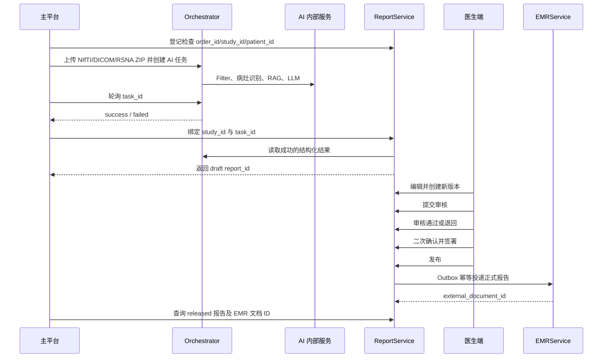

# 头部 CT AI 子系统与主平台协同工作说明

## 1. 文档目的

本文说明智慧云脑诊疗主平台如何与当前头部 CT AI 子系统协同工作，适用于：

- 主平台后端开发；
- 检查检验模块开发；
- 医生端与门诊工作台开发；
- 统一身份认证与 API 网关开发；
- 部署、联调和测试人员。

当前已跑通的完整链路为：

```text
主平台检查检验模块
 -> HeadCTOrchestrator
 -> Filter 金属伪影识别
 -> HeadCTLesionDetection 病灶识别
 -> pgvector HNSW 检索与 Rerank
 -> DashScope LLM 报告辅助
 -> HeadCTReportService 报告生命周期
 -> 医生审核、签署与发布
 -> Outbox
 -> HeadCTEMRService 电子病历入库
```

现阶段 Orchestrator 已预先接入 DICOM/RSNA：主平台可以上传 `.nii`、`.nii.gz`、`.dcm`、
`.dicom` 或 DICOM Series `.zip`。Orchestrator 会统一归一化为内部 `input.nii.gz` 后再调用
Filter 与病灶识别服务。

---

## 2. 服务边界

### 2.1 主平台允许直接调用的服务

主平台业务代码只应直接依赖以下两个服务：

| 服务 | 默认地址 | 主平台用途 |
| --- | --- | --- |
| `HeadCTOrchestrator` | `http://127.0.0.1:8010` | 创建 AI 分析任务、查询状态、获取结构化分析结果 |
| `HeadCTReportService` | `http://127.0.0.1:8030` | 登记检查、创建报告、医生审核、签署、发布及查询 |

主平台运维健康页可以检查所有服务，但业务代码不应直接调用 Filter、LesionDetection、RAG 数据库。

### 2.2 内部服务

| 服务 | 默认地址 | 说明 |
| --- | --- | --- |
| `Filter` | `http://127.0.0.1:8000` | 由 Orchestrator 调用，识别金属伪影 |
| `HeadCTLesionDetection` | `http://127.0.0.1:8021` | 由 Orchestrator 调用，当前机器 `8020` 被其他程序占用 |
| `HeadCTEMRService` | `http://127.0.0.1:8040` | 由 ReportService 的 Outbox 投递调用 |
| PostgreSQL/pgvector | 本机 PostgreSQL | 保存 RAG、报告、审核、审计和本地 EMR 数据 |
| DashScope | 外部 HTTPS 服务 | Embedding、Rerank 和 LLM 报告辅助 |

### 2.3 禁止的耦合方式

主平台不得：

- 直接读取 `orchestrator_outputs`、`filter_outputs` 或 `lesion_outputs` 文件夹；
- 直接查询 AI 子系统内部 PostgreSQL 表作为业务接口；
- 直接调用 Filter 或病灶服务并自行拼接结果；
- 将 `report_assist` 自动写成已签署报告；
- 让 AI、LLM 或管理员账号替代医生签署；
- 在主平台代码或配置仓库中明文保存 DashScope API Key、数据库密码和 EMR 服务令牌。

---

## 3. 统一业务标识

主平台应维护以下标识之间的映射：

| 标识 | 产生方 | 含义 | 是否长期保存 |
| --- | --- | --- | --- |
| `patient_id` | 主平台 | 患者唯一标识 | 是 |
| `order_id` | 检查检验模块 | 检查申请唯一标识 | 是 |
| `study_id` | 检查检验模块 | 一次影像检查唯一标识 | 是 |
| `accession_number` | 检查检验模块 | 检查流水号 | 是 |
| `series_id` | 影像系统 | 影像序列标识 | 建议保存 |
| `study_instance_uid` | DICOM/PACS | DICOM Study UID | DICOM 上传时建议保存 |
| `task_id` | Orchestrator | AI 分析任务标识 | 是 |
| `report_id` | ReportService | 正式报告生命周期标识 | 是 |
| `external_document_id` | EMRService | 电子病历文档标识 | 是 |

强制约束：

- 一个 `study_id` 只能绑定一个检查记录；
- 一个成功的 `task_id` 只能创建一份报告；
- 同一业务请求必须重复使用相同 `Idempotency-Key`；
- `task_id` 中的 `patient_id`、`study_id` 必须与报告创建请求一致；
- 主平台不能使用患者姓名作为关联主键。

建议主平台建立映射表：

```text
head_ct_ai_case
  patient_id
  order_id
  study_id
  accession_number
  orchestrator_task_id
  report_id
  external_document_id
  ai_status
  report_status
  created_at
  updated_at
```

---

## 4. 推荐协同时序



---

## 5. 主流程接口

## 5.1 健康检查

主平台启动或定时巡检时调用：

```http
GET http://127.0.0.1:8010/api/head-ct-ai/health
GET http://127.0.0.1:8030/api/v1/health
```

只有两个接口均返回 `status=ok` 时，主平台才允许创建新的 AI 任务。

报告服务健康响应会同时反映：

- PostgreSQL；
- Orchestrator；
- Filter；
- LesionDetection；
- pgvector RAG；
- EMRService。

若状态为 `degraded`，主平台应展示“AI 服务暂不可用”，不能静默提交任务。

## 5.2 登记检查

在上传 CT 前，主平台先向 ReportService 登记检查：

```http
POST http://127.0.0.1:8030/api/v1/integrations/examinations
Content-Type: application/json
X-Actor-Id: platform-check-service
X-Actor-Role: integration_service
X-Request-Id: trace-20260615-001
```

```json
{
  "order_id": "ORDER-20260615-001",
  "study_id": "STUDY-20260615-001",
  "patient_id": "PATIENT-001",
  "accession_number": "ACC-20260615-001",
  "patient_name": null,
  "department": "急诊科",
  "ordering_doctor_id": "doctor-ordering-001",
  "study_instance_uid": null
}
```

建议跨服务只传递患者脱敏 ID。患者姓名等敏感信息应优先由主平台管理。

## 5.3 创建 AI 分析任务

```http
POST http://127.0.0.1:8010/api/head-ct-ai/tasks
Content-Type: multipart/form-data
```

表单字段：

| 字段 | 必填 | 说明 |
| --- | --- | --- |
| `file` | 是 | `.nii`、`.nii.gz`、`.dcm`、`.dicom` 或 DICOM Series `.zip` |
| `patient_id` | 建议必填 | 必须与登记检查一致 |
| `study_id` | 建议必填 | 必须与登记检查一致 |
| `series_id` | 否 | 影像序列标识 |
| `report_id` | 否 | 初次分析时通常为空 |
| `doctor_id` | 否 | 发起医生或责任医生 |

说明：

- 单个 RSNA DICOM slice 可直接以 `.dcm` 上传，用于模型接入和快速联调。
- 一次完整检查建议上传同一 Series 的 DICOM `.zip`，Orchestrator 会选择可识别的最大 series 并转换为 NIfTI。
- 主平台仍应保存 `study_instance_uid`、`series_id`、`accession_number` 等业务标识；当前接口不直接解析并回写患者主索引。
- DICOM ZIP 不允许路径穿越；无法读取或无法转换时返回 `DICOM_NORMALIZATION_FAILED`。

成功后主平台保存：

```json
{
  "task_id": "4ef1d052db084a9aa02cdea4278fae3d",
  "status": "queued",
  "task_url": "/api/head-ct-ai/tasks/4ef1d052db084a9aa02cdea4278fae3d",
  "result_url": "/api/head-ct-ai/results/4ef1d052db084a9aa02cdea4278fae3d"
}
```

## 5.4 查询任务状态

```http
GET http://127.0.0.1:8010/api/head-ct-ai/tasks/{task_id}
```

当前没有任务完成 Webhook，主平台应轮询：

- 建议间隔：1 秒；
- 建议最长等待：300 秒；
- 页面离开后可由后台任务继续轮询；
- 不要由浏览器直接无限轮询 AI 服务，应通过主平台后端统一管理。

终态：

```text
success
failed
```

任务失败时保存并展示：

- `error_code`；
- `error_message`；
- `pipeline`；
- `finished_at`。

只有 `success` 可以进入报告创建流程。

## 5.5 绑定分析结果并创建报告草稿

推荐使用已经登记的 `study_id`：

```http
POST http://127.0.0.1:8030/api/v1/integrations/examinations/STUDY-20260615-001/analysis
Content-Type: application/json
X-Actor-Id: platform-check-service
X-Actor-Role: integration_service
X-Request-Id: trace-20260615-002
Idempotency-Key: report-STUDY-20260615-001-v1
```

```json
{
  "orchestrator_task_id": "4ef1d052db084a9aa02cdea4278fae3d",
  "assigned_doctor_id": "doctor-reporting-001"
}
```

ReportService 会自行调用 Orchestrator 读取结果并保存只读快照。主平台不需要把大段 AI 结果再次转发给 ReportService。

返回的关键字段：

```json
{
  "status": "success",
  "report": {
    "id": "54d8af51-b5ce-4e56-ba78-9f487928fcd6",
    "status": "draft",
    "version_number": 1,
    "version_lock": 1,
    "findings": "AI 生成的影像所见草稿",
    "impression": "AI 生成的诊断意见草稿",
    "recommendations": "建议与局限性",
    "deployment_mode": "development"
  }
}
```

主平台保存 `report.id`，并把检查状态更新为“报告草稿”。

---

## 6. 医生工作流

医生端可以直接嵌入 `http://127.0.0.1:8030` 的工作台，也可以由主平台按照以下接口自行实现页面。

### 6.1 查询工作列表

```http
GET /api/v1/reports?status=pending_review&doctor_id=doctor-001&department=急诊科
X-Actor-Id: doctor-001
X-Actor-Role: reporting_doctor
```

主平台角色与报告服务角色建议映射：

| 主平台角色 | `X-Actor-Role` |
| --- | --- |
| 检查技师 | `technician` |
| 报告医生 | `reporting_doctor` |
| 审核医生 | `reviewing_doctor` |
| 签署医生 | `signing_doctor` |
| 平台管理员 | `administrator` |
| 服务账号 | `integration_service` |

### 6.2 编辑报告

```http
PATCH /api/v1/reports/{report_id}/draft
```

```json
{
  "findings": "医生复核后的影像所见",
  "impression": "医生复核后的诊断意见",
  "recommendations": "建议",
  "expected_version": 1,
  "change_reason": "结合原始影像修订"
}
```

主平台必须传递当前 `version_lock`。收到 `REPORT_VERSION_CONFLICT` 时：

1. 不覆盖服务器内容；
2. 重新获取报告；
3. 提示用户报告已被其他人修改；
4. 由医生决定重新编辑或对比版本。

### 6.3 状态流转

```text
draft
 -> pending_review
 -> approved
 -> signed
 -> released
```

退回路径：

```text
pending_review -> revision_required -> pending_review
```

对应接口：

```http
POST /api/v1/reports/{report_id}/submit-review
POST /api/v1/reports/{report_id}/approve
POST /api/v1/reports/{report_id}/request-revision
POST /api/v1/reports/{report_id}/sign
POST /api/v1/reports/{report_id}/release
```

退回修订必须填写 `comment`。

签署时必须增加二次确认头：

```http
X-Signature-Confirmation: confirm
```

主平台应在调用签署接口前要求医生进行明确确认。生产环境建议升级为短时签名令牌或统一认证二次验证，而不是让前端固定发送 `confirm`。

### 6.4 已发布报告修改

已发布报告不可直接覆盖。必须调用：

```http
POST /api/v1/reports/{report_id}/amendments
```

```json
{
  "findings": "补充后的影像所见",
  "impression": "补充诊断意见",
  "recommendations": "补充建议",
  "reason": "新增临床资料后补充报告"
}
```

补充报告需重新审核、签署和发布。

---

## 7. EMR 协同方式

主平台通常不需要直接调用 EMRService。ReportService 在报告发布时创建 Outbox 事件，再由后台调度执行：

```http
POST /api/v1/integrations/emr/dispatch?limit=20
X-Actor-Id: emr-bridge
X-Actor-Role: integration_service
```

建议生产环境每 5 至 10 秒调用一次，或将该操作改造成独立后台 Worker。

投递成功后，ReportService 报告字段会出现：

```json
{
  "status": "released",
  "external_document_id": "DR-D8BB9632A31E46C99F816C8798723692"
}
```

主平台以 ReportService 返回的 `external_document_id` 为准，不应自行生成 EMR 文档号。

当前 `HeadCTEMRService` 是真实 PostgreSQL 本地后端，不是 Fake，但不是具体医院的生产 HIS/EMR。对接医院时应保留 ReportService Outbox，在 EMR 客户端层替换：

- 医院服务地址；
- 服务身份认证；
- 患者主索引映射；
- 报告字段标准；
- 回执和撤回机制。

---

## 8. 身份认证与网关

### 8.1 ReportService

当前读取以下可信请求头：

```http
X-Actor-Id
X-Actor-Role
X-Request-Id
```

生产部署要求 API 网关：

1. 验证主平台登录令牌；
2. 删除客户端自行传入的 `X-Actor-*`；
3. 根据真实登录用户重新写入身份和角色；
4. 将 `X-Request-Id` 贯穿主平台、AI、报告和 EMR 日志；
5. 限制报告接口只允许内网或网关访问。

### 8.2 Orchestrator

当前 Orchestrator 未实现独立用户认证，必须放在主平台内网或 API 网关后，禁止直接暴露到公网。

### 8.3 EMRService

ReportService 使用：

```http
Authorization: Bearer <EMR_SERVICE_TOKEN>
```

该令牌仅用于服务间调用，不能传递给浏览器或移动端。

---

## 9. 主平台状态映射

建议主平台将技术状态映射为用户可理解的业务状态：

| 子系统状态 | 主平台展示 |
| --- | --- |
| `queued` | 等待 AI 分析 |
| `running_filter` | 正在进行图像质控 |
| `success` 且未创建报告 | AI 分析完成 |
| `failed` | AI 分析失败 |
| `draft` | 报告草稿 |
| `pending_review` | 待审核 |
| `revision_required` | 待修订 |
| `approved` | 审核通过，待签署 |
| `signed` | 已签署，待发布 |
| `released` 且无 `external_document_id` | 已发布，等待写入电子病历 |
| `released` 且有 `external_document_id` | 已归档至电子病历 |
| `amendment_draft` | 补充报告编辑中 |

---

## 10. 幂等、超时与重试

### 10.1 幂等键

推荐格式：

```text
create-report:{study_id}:{analysis_revision}
```

同一业务动作重试时必须复用原键。不要每次重试都生成新 UUID。

### 10.2 调用超时

建议：

| 调用 | 连接/响应超时 |
| --- | --- |
| 健康检查 | 3 至 5 秒 |
| 创建 Orchestrator 任务 | 30 秒 |
| 查询任务 | 5 秒 |
| 报告读写 | 10 秒 |
| EMR Dispatch | 30 秒 |

AI 推理是异步任务，主平台不能把创建任务接口的 HTTP 超时设为整个推理时长。

### 10.3 重试策略

- 网络超时、502、503：可指数退避重试；
- 400、401、403、422：修正请求，不自动重试；
- 409：读取服务器最新状态后决定；
- AI 任务 `failed`：保留原失败记录，重新创建新任务；
- EMR 投递失败：由 Outbox 重试，不重新发布报告。

---

## 11. 错误处理

Orchestrator 错误结构：

```json
{
  "status": "failed",
  "error_code": "LESION_TASK_FAILED",
  "message": "..."
}
```

ReportService 错误结构：

```json
{
  "error": {
    "code": "REPORT_STATE_CONFLICT",
    "message": "当前报告状态不允许执行该操作",
    "details": {}
  }
}
```

主平台重点处理：

| 错误码 | 处理建议 |
| --- | --- |
| `INVALID_FILE_TYPE` | 提示仅支持 NIfTI、DICOM 单文件或 DICOM ZIP |
| `DICOM_NORMALIZATION_FAILED` | 提示影像包无法解析，建议检查是否为同一 CT Series 或重新导出 |
| `FILTER_UNAVAILABLE` | 暂停创建任务并告警 |
| `LESION_SERVICE_UNAVAILABLE` | 暂停创建任务并告警 |
| `LLM_PROVIDER_FAILED` | 记录外部 LLM 故障并允许稍后重试新任务 |
| `ANALYSIS_NOT_COMPLETED` | 继续轮询，不创建报告 |
| `EXAMINATION_ID_MISMATCH` | 阻断流程并人工核对患者/检查标识 |
| `REPORT_VERSION_CONFLICT` | 重新加载报告，不覆盖他人修改 |
| `REPORT_STATE_CONFLICT` | 刷新状态并禁用非法操作按钮 |
| `REVIEW_PERMISSION_DENIED` | 检查主平台角色映射 |
| `SIGNATURE_CONFIRMATION_REQUIRED` | 重新进行医生二次确认 |

---

## 12. 主平台数据展示要求

主平台医生端应展示：

- 原始检查和患者基本上下文；
- 图像质控严重程度及伪影警告；
- 病灶识别类别、置信度和模型版本；
- `analysis_reliability` 与限制说明；
- AI 报告草稿与医生修改内容；
- RAG 引用来源；
- LLM 提供方、模型和安全重写记录；
- 报告当前状态、版本、审核人、签署人；
- EMR 文档 ID 和同步状态；
- “AI 结果仅供辅助参考，最终结论需医生审核”提示。

主平台患者端只能展示已发布且符合平台发布策略的报告，不应展示 AI 草稿、内部置信度或未审核内容。

---

## 13. 部署配置

本地统一启动：

```powershell
.\scripts\start_headct_platform.ps1
```

健康检查：

```powershell
.\scripts\check_headct_platform.ps1
```

五服务端到端验证：

```powershell
python .\scripts\smoke_test_headct_platform.py
```

当前端口：

```text
8000  Filter
8010  Orchestrator
8021  LesionDetection
8030  ReportService/医生工作台
8040  EMRService
```

主平台环境变量建议：

```text
HEAD_CT_ORCHESTRATOR_BASE_URL=http://127.0.0.1:8010
HEAD_CT_REPORT_BASE_URL=http://127.0.0.1:8030
HEAD_CT_TASK_POLL_INTERVAL_MS=1000
HEAD_CT_TASK_TIMEOUT_SECONDS=300
```

---

## 14. Spring Boot 调用骨架

主平台服务配置：

```yaml
head-ct:
  orchestrator-base-url: http://127.0.0.1:8010
  report-base-url: http://127.0.0.1:8030
  poll-interval-ms: 1000
  timeout-seconds: 300
```

主平台建议封装三个客户端：

```text
HeadCtOrchestratorClient
  createTask(...)
  getTask(taskId)
  getResult(taskId)

HeadCtReportClient
  registerExamination(...)
  bindAnalysis(studyId, taskId, idempotencyKey)
  getReport(reportId)
  editDraft(...)
  submitReview(...)
  approve(...)
  sign(...)
  release(...)

HeadCtWorkflowService
  startAnalysis(orderId, studyId, file)
  pollAnalysis(taskId)
  createDraftAfterSuccess(studyId, taskId)
  synchronizeReportStatus(reportId)
```

所有 ReportService 请求统一增加：

```java
headers.set("X-Actor-Id", authenticatedUserId);
headers.set("X-Actor-Role", mappedReportRole);
headers.set("X-Request-Id", traceId);
```

调用签署接口时额外增加经过二次确认后生成的确认信息。当前本地接口接受：

```java
headers.set("X-Signature-Confirmation", "confirm");
```

---

## 15. 联调验收清单

主平台接入完成需验证：

1. 主平台能登记检查并保存 `order_id`、`study_id`；
2. 能上传 NIfTI、单个 DICOM 和 DICOM Series ZIP 并获取 `task_id`；
3. 能正确轮询 `success` 和 `failed`；
4. 成功任务能幂等创建唯一报告；
5. 患者或检查标识不一致时流程被阻断；
6. 医生可以编辑、提交审核、退回和重新提交；
7. 并发版本冲突不会覆盖报告；
8. 无权限用户不能审核或签署；
9. 签署必须经过二次确认；
10. 发布后生成 Outbox，EMR 入库后回写文档 ID；
11. 已发布报告不能原地覆盖，只能创建补充报告；
12. 主平台日志可通过 `X-Request-Id` 串联请求；
13. 患者端不会看到草稿和未审核 AI 内容；
14. 任一内部服务异常时，主平台有明确状态和错误提示；
15. 完整自动化测试及 `smoke_test_headct_platform.py` 均通过。

---

## 16. 当前限制与后续工作

当前已具备主平台技术接入条件，但上线前仍需完成：

- 使用正式训练和评估通过的模型权重替换 smoke checkpoint；
- PACS/DICOMweb 在线拉取尚未接入；当前 DICOM 支持为文件上传预接入；
- 将 Orchestrator 放入统一认证网关；
- 将固定签署确认升级为真实二次认证或电子签名；
- 将 EMR Dispatch 改为常驻后台 Worker；

现有 smoke 模型和本地 EMR 适合平台开发、接口联调和演示，不可直接作为临床生产系统发布。
